# Abstract Syntax Tree (AST)

### Table of Contents

- [Description](#description)
- [Preprocessing in OCaml](#preprocessing-in-ocaml)
- [AST Guide](#ast-guide)
- [Why Should I Understand the AST?](#why-should-i-understand-the-ast)
- [First Look](#first-look)
- [Structure](#structure)
- [Language Extensions and Attributes](#language-extensions-and-attributes)
- [Samples](#samples)

## Description

The Abstract Syntax Tree (AST) is a critical component in the OCaml compilation process. It represents the structure of the source code in a tree-like format, allowing for advanced code manipulations and transformations. This guide explores the importance of the AST, how it is used in preprocessing, and the different methods available for working with it through **PPX** (PreProcessor eXtensions).

### Preprocessing in OCaml

Unlike some programming languages that have built-in preprocessing features—such as C's preprocessor or Rust's macro system, OCaml lacks an integrated macro system. Instead, it relies on standalone preprocessors.

The OCaml Platform officially supports a library for creating these preprocessors, which can operate at two levels:

- **Source Level**: Preprocessors work directly on the source code.
- **AST Level**: Preprocessors manipulate the AST, offering more powerful and flexible transformations. (Covered in this guide)

> [!WARNING]  
> One of the key challenges with working with the Parsetree (the AST in OCaml) is that its API is not stable. For instance, in the OCaml 4.13 release, significant changes were made to the Parsetree type, which can impact the compatibility of your preprocessing tools. Read more about it in [The Future of PPX](https://discuss.ocaml.org/t/the-future-of-ppx/3766)

### AST Guide

This guide will concentrate on AST-level preprocessing using **PPX** (PreProcessor eXtensions), providing a comprehensive overview of the following topics:

1.  **AST Construction**: Learning how to build and manipulate ASTs.
2.  **AST Destructuring**: Breaking down ASTs into manageable components for advanced transformations.

### Why Should I Understand the AST?

OCaml's Parsetree can be confusing, verbose, and hard to understand, but it's a powerful tool that can help you write better code, understand how the compiler works, and develop your own PPXs.

You don't need to be an expert on it knowing all the tree possibilities, but you should know how to read it. For this, I'm going to use the [AST Explorer](https://astexplorer.net/) throughout the repository to help you understand the AST.

A simple example of learning more about the OCaml compiler is that types are recursive by default, while values are non-recursive.
With the AST, we can see this clearly:
```ocaml
type name = string
let name = "John Doe"

(* AST Tree *)
(* type name = string *)
[ Pstr_type
    ( Recursive
    , [ { ptype_name =
            { txt = "name"
            ; loc = { (* ... *) }
            }
        ; ptype_params = []
        ; ptype_cstrs = []
        ; ptype_kind = Ptype_abstract
        ; ptype_private = Public
        ; ptype_manifest =
            Some
              { ptyp_desc =
                  Ptyp_constr
                    ( { txt = Lident "string"
                      ; loc = { (* ... *) }
                      }
                    , []
                    )
              ; ptyp_loc = { (* ... *) }
              ; ptyp_loc_stack = __lstack
              ; ptyp_attributes = []
              }
        ; ptype_attributes = []
        ; ptype_loc = { (* ... *) }
        }
      ]
    )
; Pstr_value
    ( Nonrecursive
    , [ { pvb_pat =
            { ppat_desc =
                Ppat_var
                  { txt = "name"
                  ; loc = { (* ... *) }
                  }
            ; ppat_loc = { (* ... *) }
            ; ppat_loc_stack = [ ]
            ; ppat_attributes = []
            }
        ; pvb_expr =
            { pexp_desc =
                Pexp_constant
                  (Pconst_string
                     ( "John Doe"
                     , (* loc ... *)
                     , None
                     ))
            ; pexp_loc = { (* ... *) }
            ; pexp_loc_stack = [ (* ... *) ]
            ; pexp_attributes = []
            }
        ; pvb_attributes = []
        ; pvb_loc = { (* ... *) }
        }
      ]
    )
]
```

### First Look

By comparing code snippets with their AST representations, you'll better understand how OCaml interprets your code, which is essential for working with PPXs or delving into the compiler's internals. The [AST Explorer](https://astexplorer.net/) tool will help make these concepts clearer and more accessible.

Let's take a quick look at the JSON AST representation of a simple OCaml expression:

```ocaml
(* Foo.ml *)
let name = "john doe"

(* AST Tree *)
(* let name = "john doe" *)
[ Pstr_type
    ( Recursive
    , [ { ptype_name = "name"
        ; ptype_params = []
        ; ptype_cstrs = []
        ; ptype_kind = Ptype_abstract
        ; ptype_private = Public
        ; ptype_manifest = Some (Ptyp_constr ( Lident "string", []))
        ; ptype_attributes = []
        ; ptype_loc = { (* ... *) }
        }
      ]
    )
; Pstr_value
    ( Nonrecursive
    , [ { pvb_pat = Ppat_var "name"
        ; pvb_expr = Pexp_constant (Pconst_string ( "John Doe", (* loc ... *) , None))
        ; pvb_attributes = []
        ; pvb_loc = { (* ... *) }
        }
      ]
    )
]
```

As you can see, it's a little bit verbose. Don't be scared; we are going to learn how to read it, which is the most important thing.

### Structure

```ocaml
(* Foo.ml *)
let name = "john doe"

(* AST Tree *)
(* let name = "john doe" *)
(* This entire list is a structure *)
[ Pstr_value
    ( Nonrecursive
    , [ { pvb_pat = Ppat_var "name"
        ; pvb_expr = Pexp_constant (Pconst_string ( "john doe", (* loc ... *) , None))
        ; pvb_attributes = []
        ; pvb_loc = { (* ... *) }
        }
      ]
    )
]
```

In OCaml, a **module** serves as a container for grouping related definitions, such as types, values, functions, and even other modules, into a single cohesive unit. This modular approach helps organize your code, making it more manageable, reusable, and easier to understand.

A **structure** refers to the content within a module. It is composed of various declarations, known as **structure items**, which include:

- **Type definitions** (e.g., `type t = ...`)
- **`let` bindings** (e.g., `let x = 1`)
- **Function definitions**
- **Exception declarations**
- **Other nested modules**

The structure represents the body of the module, where all these items are defined and implemented. Since each `.ml` file is implicitly a module, the entire content of a file can be viewed as the structure of that module.

> [!TIP] 
> Every module in OCaml creates a new structure, and nested modules create nested structures.

Consider the following example:

```ocaml
(* Bar.ml *)
let name = "john doe"

module GameEnum = struct
  type t = Rock | Paper | Scissors

  let to_string = function
    | Rock -> "Rock"
    | Paper -> "Paper"
    | Scissors -> "Scissors"

  let from_string = function
    | "Rock" -> Rock
    | "Paper" -> Paper
    | "Scissors" -> Scissors
    | _ -> failwith "Invalid string"
end
```

```ocaml
[ 
  (* This is a structure item *)
  Pstr_value
    ( Nonrecursive
    , [ { pvb_pat = Ppat_var "name"
        ; pvb_expr = Pexp_constant (Pconst_string ( "john doe", __loc, None))
        ; pvb_attributes = []
        ; pvb_loc = __loc
        }
      ]
    )

  (* This is a structure item *)
  ; Pstr_module
      { pmb_name = Some "GameEnum"
      (* This is a structure *)
      ; pmb_expr =
          Pmod_structure
            [ (* ... Structure items ... *) ]
      ; pmb_attributes = []
      ; pmb_loc = { (* ... *) }
      }
]
```

As you can see, `Bar.ml` and `GameEnum` are modules, and their content is a **structure** that contain a list of **structure items**.

> [!NOTE]
> A structure item can either represent a top-level expression, a type definition, a `let` definition, etc.

I'm not going to be able to cover all structure items, but you can find more about it in the [OCaml documentation](https://ocaml.org/learn/tutorials/modules.html). I strongly advise you to take a look at the [AST Explorer](./ast_explorer.ml) file and play with it; it will help you a lot. The `ppxlib-pp-ast` command is an official ppxlib tool that allows you to see the AST of a given OCaml file/string.

### Language Extensions and Attributes

As the AST represents the structure of the source code in a tree-like format, it also represents the Extension nodes and Attributes. It is mostly from the extension and attributes that the PPXs are built, so it's important to understand that they are part of the AST and have their own structure.

- <span name="ast_extension_node"><strong>Extension nodes</strong></span> are generic placeholders in the syntax tree. They are rejected by the type-checker and are intended to be “expanded” by external tools such as -ppx rewriters. On AST, it is represented as `string Ast_414.Asttypes.loc * payload`.

  So, as extension nodes are placeholders for a code to be added, adding a new extension node with no extender declared should break the compilation. For example, in the code `let name = [%name "John Doe"]`. See a demo [here](https://sketch.sh/s/6DxhTCXYpOkI0G8k9keD0d/)

  There are 2 forms of extension nodes:

  - **For “algebraic” categories**: `[%name "John Doe"]`
  - **For structures and signatures**: `[%%name "John Doe"]`
<br>

  > In the code `let name = [%name "John Doe"]`, `[%name "John Doe"]` is the extension node, where **name** is the extension name (`string Ast_414.Asttypes.loc`) and **"John Doe"** is the `payload`. For the entire item `let name = "John Doe"`, you must use `%%`: `[%%name "John Doe]`.

  Don't worry much about creating a new extension node; we'll cover it in the [Writing PPXs section](../2%20-%20Writing%20PPXs/README.md).

- <span name="ast_attributes"><strong>Attributes</strong></span> are “decorations” of the syntax tree, which are mostly ignored by the type-checker but can be used by external tools. Decorators must be attached to a specific node in the syntax tree, otherwise it will break the compilation. (Check it breaking on this running `ppxlib-pp-ast --exp "[@foo]"`)

  As attributes are just “decorations”, you can add a new attribute without breaking the compilation. For example, in the code, `let name = "John Doe" [@print]`. See a demo [here](https://sketch.sh/s/6DxhTCXYpOkI0G8k9keD0d/)

  There are 3 forms of attributes:

  - **Attached to on “algebraic” categories**: `[@name]`
  - **Attached to “blocks”**: `[@@name]`
  - **Stand-alone of signatures or structures modules**: `[@@@name]`
<br>

  > In the code `let name = "John Doe" [@print expr]`, `[@print expr]` is the attribute of the `"John Doe"` node, where **print** is the attribute name (`string Ast_414.Asttypes.loc`) and **expr** is the `payload`. To be an attribute of the entire item `let name = "John Doe"`, you must use `@@`: `[@@print]`. If it is an stand-alone attribute of a module, you must use `@@@`: `[@@@print]`.

  Don't worry much about creating a new attributes node; we'll cover it in the [Writing PPXs section](../2%20-%20Writing%20PPXs/README.md).
<br>

I know that it can be a lot, but don't worry; we are going step by step, and you are going to understand it.

### Samples 
[//]: <> (TODO: use ppxlib-pp-ast to generate the AST as ASTExplorer is outdated)

To help you undestand a little bit more about the AST, let's show it with some highlighted examples:

| Code                                          | Playgrond                                                                   | AST                                                                      |
| --------------------------------------------- | --------------------------------------------------------------------- | ------------------------------------------------------------------------ |
|  | [Link ](https://astexplorer.net/#/gist/d479d32127d6fcb418622ee84b9aa3b2/1d56a1d5b20fc0a55d5ae9d309226dce58f93d2c) | 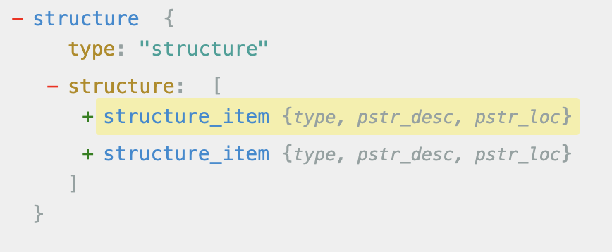 |
|        | [Link ](https://astexplorer.net/#/gist/d479d32127d6fcb418622ee84b9aa3b2/1d56a1d5b20fc0a55d5ae9d309226dce58f93d2c) | 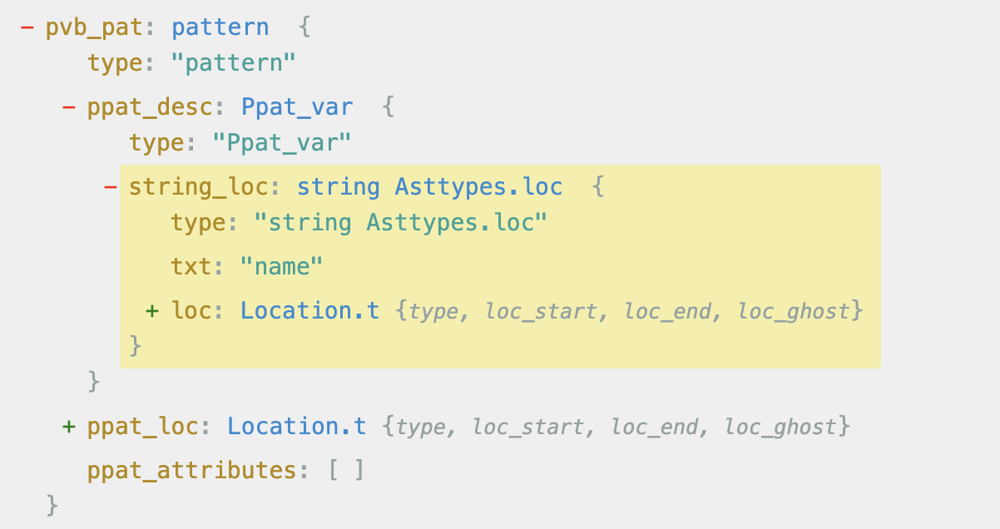                        |
| ![Code `let name = [%name "John Doe"]` with `[%name "John Doe"]` highlighted](./extension_node.png)       | [Link ](https://astexplorer.net/#/gist/d479d32127d6fcb418622ee84b9aa3b2/4002362a8c42e1c4f28790f54682a9cb4fc07a85) | 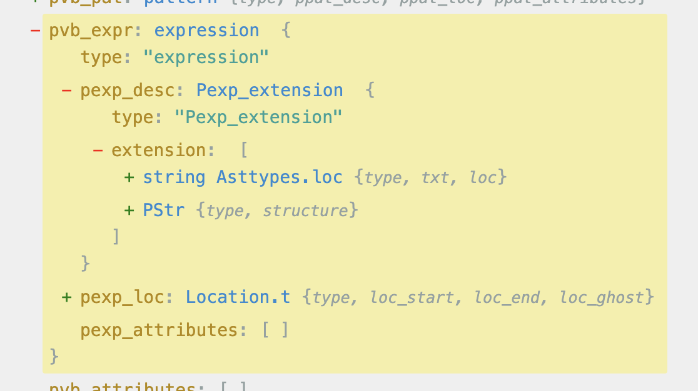                 |
| ![Code `let name = [%name "John Doe"]` with `name` highlighted](./extension_node_name.png)  | [Link ](https://astexplorer.net/#/gist/d479d32127d6fcb418622ee84b9aa3b2/4002362a8c42e1c4f28790f54682a9cb4fc07a85) | 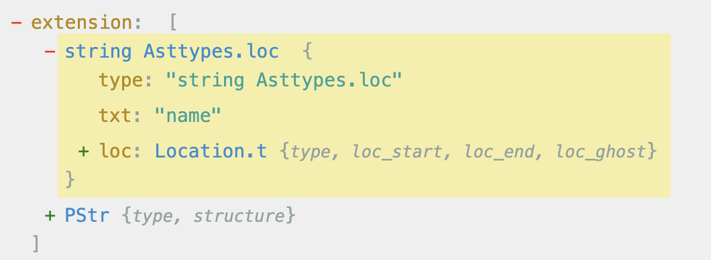            |
| ![Code `let name = [%name "John Doe"]` with `"John Doe"` highlighted](./extension_node_payload.png) | [Link ](https://astexplorer.net/#/gist/d479d32127d6fcb418622ee84b9aa3b2/4002362a8c42e1c4f28790f54682a9cb4fc07a85) | 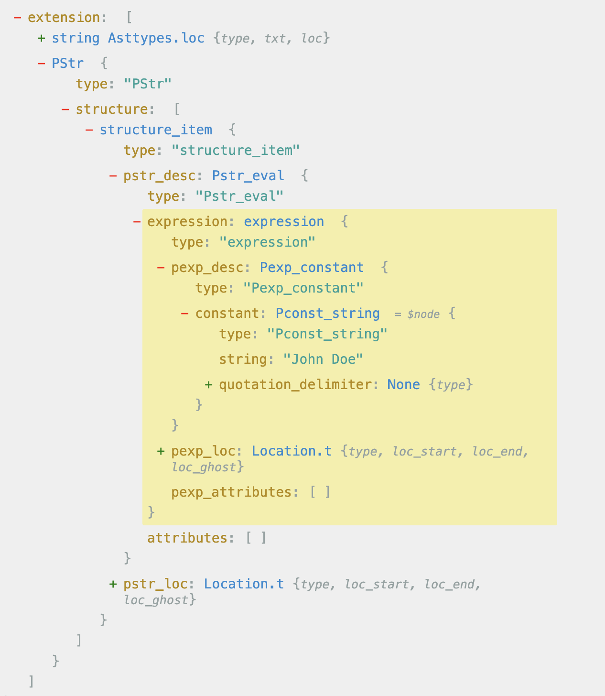         |
| ![Code `let name = "John Doe" [@print expr]` with `"John Doe"` highlighted](./attribute_attached.png) | [Link ](https://astexplorer.net/#/gist/d479d32127d6fcb418622ee84b9aa3b2/b4492b3d2d1b34029d367ff278f5bcda0496c0d2) | 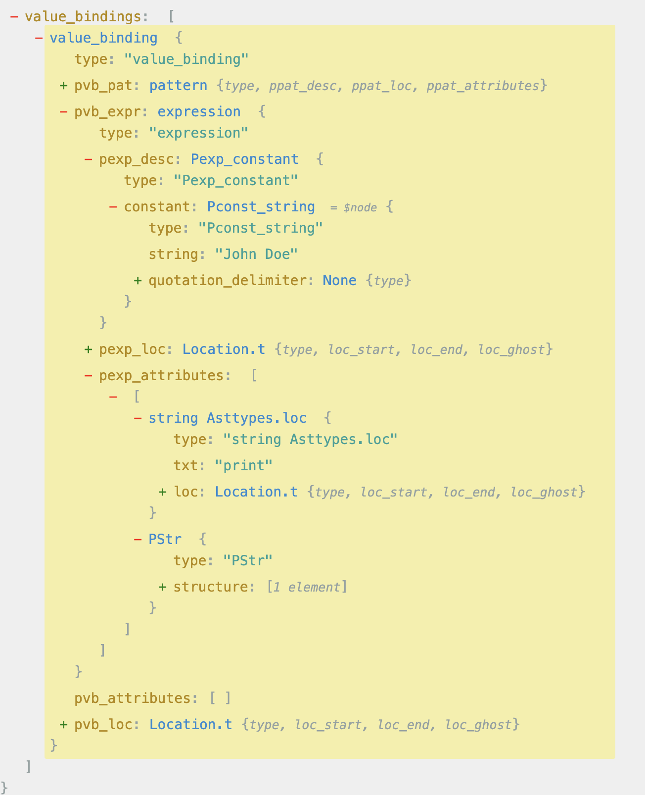             |
| ![Code `let name = "John Doe" [@print expr]` with `print` highlighted](./attribute_name.png) | [Link ](https://astexplorer.net/#/gist/d479d32127d6fcb418622ee84b9aa3b2/b4492b3d2d1b34029d367ff278f5bcda0496c0d2) | 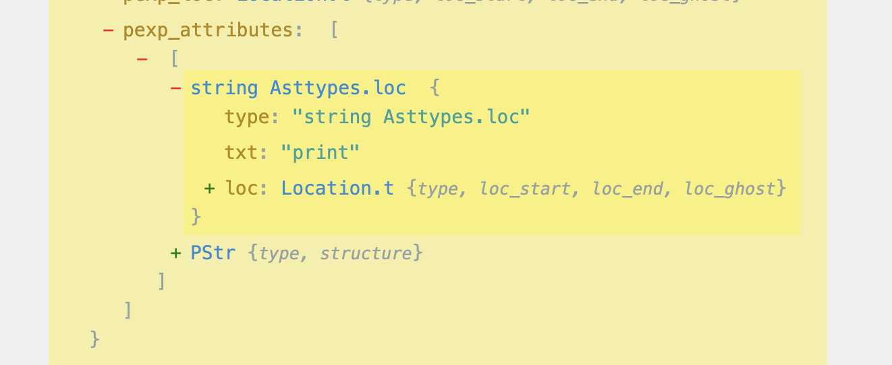                 |
| ![Code `let name = "John Doe" [@print expr]` with `expr` highlighted](./attribute_payload.png) | [Link ](https://astexplorer.net/#/gist/d479d32127d6fcb418622ee84b9aa3b2/b4492b3d2d1b34029d367ff278f5bcda0496c0d2) | 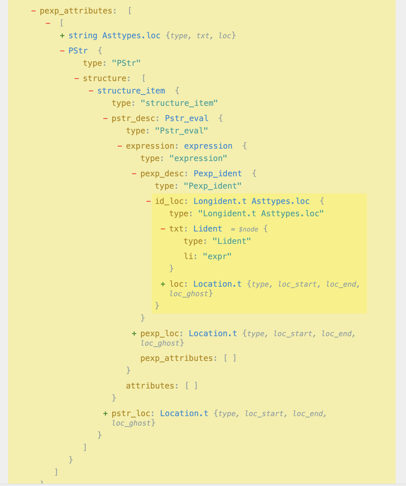              |
|  | [Link ](https://astexplorer.net/#/gist/d479d32127d6fcb418622ee84b9aa3b2/27d0a140f268bae1a32c8882d55c0b26c7e03fe9) | 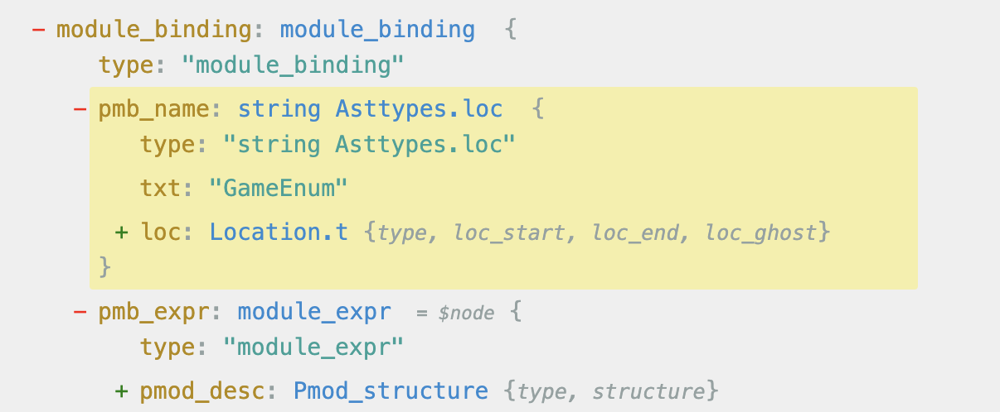         |
|  | [Link ](https://astexplorer.net/#/gist/d479d32127d6fcb418622ee84b9aa3b2/27d0a140f268bae1a32c8882d55c0b26c7e03fe9) | 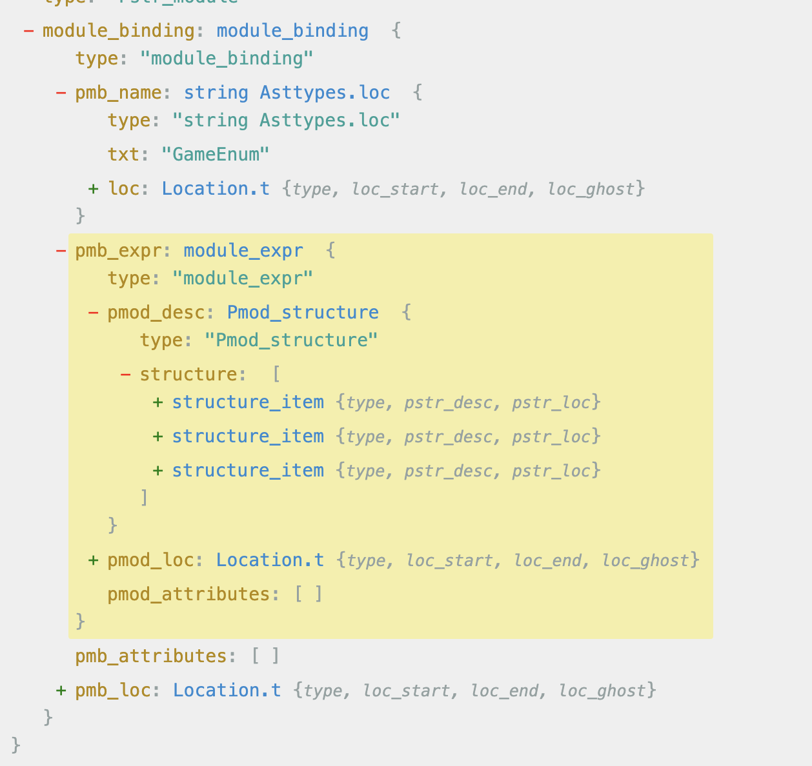         |
|  | [Link ](https://astexplorer.net/#/gist/d479d32127d6fcb418622ee84b9aa3b2/27d0a140f268bae1a32c8882d55c0b26c7e03fe9) | 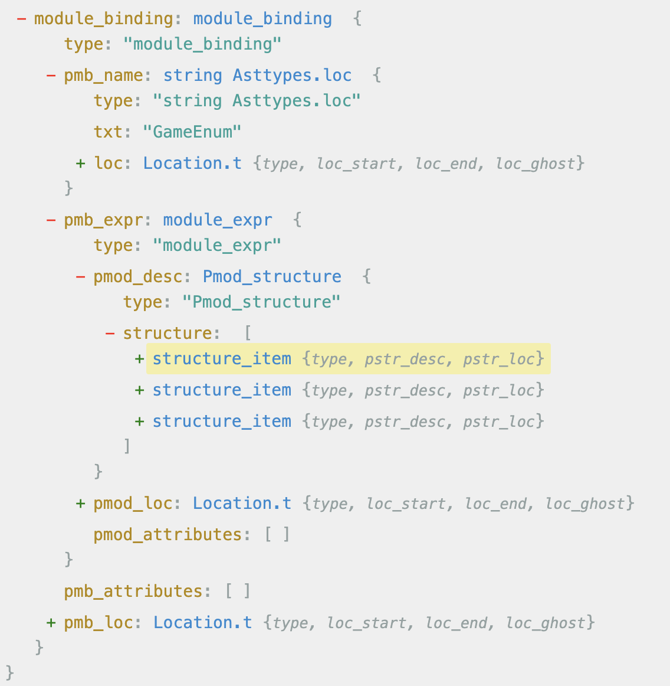         |

### [On the next section, we will learn how to build an AST.](./a%20-%20Building%20AST/README.md)
