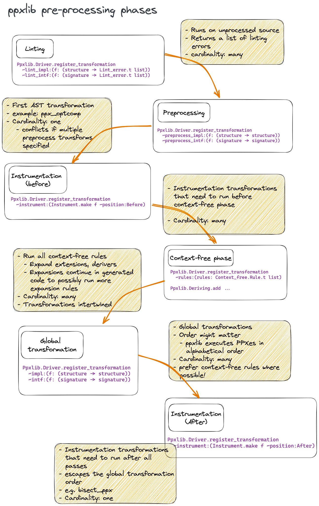

# Writing PPXs

## Description

After knowing what is an [AST](../1%20-%20AST/README.md), how to [build an AST](../1%20-%20AST/a%20-%20Building%20AST/README.md) and [destructure it](../1%20-%20AST/b%20-%20Destructing%20AST/README.md), we can now write our own PPX in OCaml.

## Transformations

The soul of a PPX is the transformation. We want to get our AST and transform it into something else, like a new AST or lint errors.

Those transformations can be divided into two categories that we will cover on nested folders:

- [Context-free transformations](./a%20-%20Context%20Free/README.md)
- [Global transformations](./b%20-%20Global/README.md)

And they can work in different phases:

- Lint (Global)
- Preprocess (Global)
- Instrumentation - Before (Global)
- Context-free
- Global Trasformation (Global)
- Instrumentation - After (Global)

The following diagram shows the order of the phases and Driver's methods:

<figure>
  
  <small><figcaption>Drive's methods phases diagram.<a href="https://x.com/_anmonteiro/status/1644031054544789504"> (reference)</a></figcaption></small>
</figure>

## How

PPXs commonly follow these steps:

- Match the AST we want.
- Work with the AST. For example:
  - Returning a new AST. Add new functions, change the name of a variable, etc.
  - Linting the code.
  - or doing anything else. Really, you're programming, everything is possible!

### [On the next section, we will learn more about Context Free transformations.](./a%20-%20Context%20Free/README.md)
